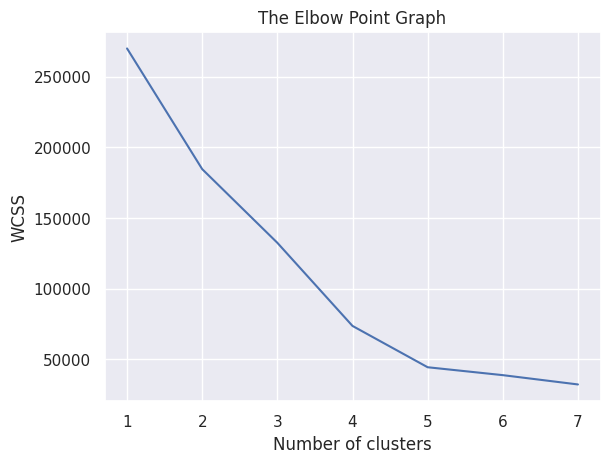
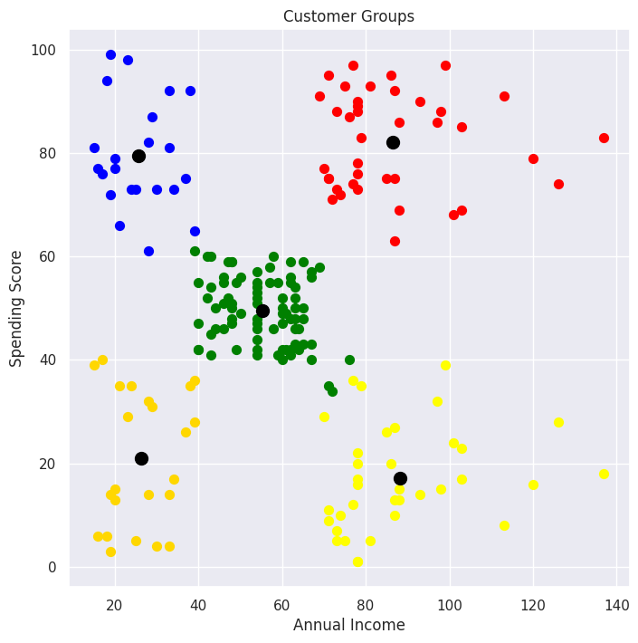

# Mall Customer Segmentation using K-Means Clustering

## Overview

This project applies **K-Means clustering** to segment mall customers based on their
**Annual Income** and **Spending Score**.
The goal is to identify distinct customer groups that can help businesses understand
customer behavior and improve targeted marketing strategies.

---

## Dataset

- **Name:** Mall_Customers.csv
- **Number of records:** 200 customers
- **Features used for clustering:**
  - Annual Income (k$)
  - Spending Score (1–100)

---

## Tools and Libraries

- Python
- NumPy
- Pandas
- Matplotlib
- Seaborn
- Scikit-learn

---

## Methodology

1. Loaded and explored the dataset
2. Checked for missing values and understood data distribution
3. Selected relevant features for clustering
4. Used the **Elbow Method** to determine the optimal number of clusters
5. Applied **K-Means clustering** with the optimal number of clusters
6. Visualized customer segments and cluster centroids

---

## Visualizations

### Elbow Method

The elbow method was used to identify the optimal number of clusters by analyzing
the Within-Cluster Sum of Squares (WCSS).

---

### Customer Segmentation

The plot below shows the final customer clusters formed using K-Means clustering.
Each color represents a different customer group, while the black points represent
cluster centroids.

---

## Results

- **Optimal number of clusters:** 5
- Customers are grouped based on similarities in income and spending behavior
- The clusters clearly separate high-spending, low-spending, and average customers

---

## Conclusion

This project demonstrates the application of **unsupervised machine learning**
for customer segmentation using K-Means clustering.
Such segmentation can help businesses design better marketing strategies
and improve customer engagement.

---

## Author

**Ogunkoya Emmanuel Oluwakemi**
